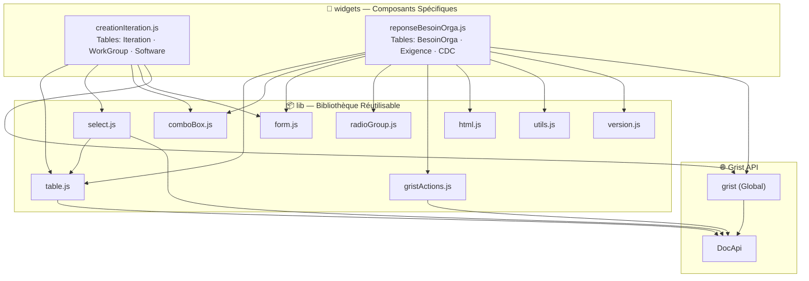
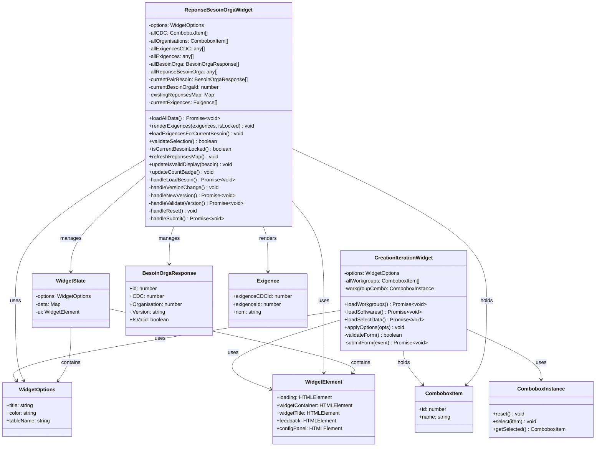
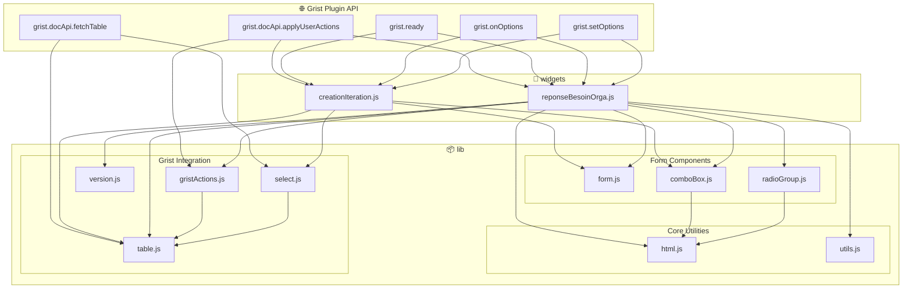

# WidgetGRIST
Bibliothèque de widget qui servent à rendre GRIST plus simple et visuel

## 🔧 Utilisation dans Grist

1. Dans une page Grist, ajouter une section **Widget personnalisé**
2. Coller l'URL du widget
3. Sélectionner la table source dans le panneau latéral
4. Choisir le niveau d'accès

## 🗂️ Structure du projet

```
WidgetGRIST/
├── README.md
├── lib/                          # Bibliothèque réutilisable
│   ├── html.js                  # Utilities DOM sécurisées
│   ├── utils.js                 # Utilitaires JavaScript génériques
│   ├── gristActions.js          # Wrappers haut niveau pour l'API Grist
│   ├── table.js                 # Extraction de données Grist
│   ├── form.js                  # Formulaires et validation
│   ├── select.js                # Composant <select> dynamique
│   ├── comboBox.js              # Combobox recherchable
│   ├── radioGroup.js            # Groupe de boutons radio
│   └── version.js               # Gestion des versions
├── widgets/                             # Widgets personnalisés
│   ├── creationIteration/               # Widget création d'itération
│   │   ├── creationIteration.html
│   │   ├── creationIteration.js
│   │   └── creationIteration.css
│   ├── reponseBesoinOrga/               # Widget réponse besoin organisation
│   │   ├── reponseBesoinOrga.html
│   │   ├── reponseBesoinOrga.js
│   │   └── reponseBesoinOrga.css
│   ├── creationCahierDesCharges/        # Widget création cahier des charges
│   ├── reponseCahierDesCharges/         # Widget réponse cahier des charges (plus d'actualité)
│   └── reponseBilanSoft/                # Widget réponse bila software
└── .github/
    └── workflows/
        └── deploy.yml
```

## Lien à mettre dans GRIST

- création d'itérations :
- création de cahier des charges :
- réponse besons organisations :
- réponses bilan de softwares :

## 📊 Architecture du Projet



## 📚 Diagramme de Classe - Bibliothèque (lib/)

```mermaid
classDiagram
    class Html {
        +escapeHtml(value) string$
        +createElement(tag, attrs, content) HTMLElement$
        +clearElement(el) void$
    }

    class Utils {
        +indexBy(items, keyFn, valueFn) Map$
        +groupBy(items, keyFn) Record$
        +sleep(ms) Promise$
        +coalesce(value, fallback) T$
    }

    class GristActions {
        +applyActions(actions) Promise$
        +addRecord(tableName, fields) Promise~number~$
        +updateRecord(tableName, id, fields) Promise~void~$
        +upsertRecord(tableName, id, fields) Promise~number~$
        +buildUpsertAction(tableName, id, fields) Array$
    }

    class Table {
        +fetchTableRows(tableName) Promise~Array~$
    }

    class Select {
        +fetchDistinctValues(tableName, columnName) Promise~string[]~$
        +populateSelect(selectEl, tableName, columnName, placeholder) Promise~void~$
    }

    class Version {
        +nextVersion(besoinList) string$
        +populateVersionSelect(selectEl, besoinList, currentId) void$
    }

    class Form {
        +showFeedback(feedbackEl, msg, type, duration) void$
        +setLoadingState(loadingEl, containerEl, state) void$
        +validateForm(rules) boolean$
        +clearValidation(rules) void$
        +toUnixTimestamp(dateStr, timeStr) number$
    }

    class ComboBox {
        +initCombobox(config) ComboboxInstance$
    }

    class RadioGroup {
        +renderRadioGroupHTML(groupName, options, selected, disabled) string$
        +getRadioValue(groupName) string$
        +validateRadioGroups(groups) boolean$
        +resetRadioGroup(groupName, groupId, errId, value) void$
    }

    class ComboboxItem {
        +id: number
        +name: string
    }

    class ComboboxConfig {
        +searchInput: HTMLInputElement
        +hiddenInput: HTMLInputElement
        +dropdown: HTMLElement
        +errorEl: HTMLElement
        +getItems() ComboboxItem[]
        +filterMode: string
    }

    class ComboboxInstance {
        +reset() void
        +select(item) void
        +getSelected() ComboboxItem
    }

    class FieldRule {
        +fieldId: string
        +errId: string
        +visualId: string
        +validator(value) boolean
    }

    class RadioOption {
        +value: string
        +label: string
    }

    class RadioGroupRule {
        +groupName: string
        +groupId: string
        +errId: string
    }

    ComboBox --> ComboboxConfig : uses
    ComboBox --> ComboboxInstance : returns
    ComboBox --> Html : uses
    ComboBox --> ComboboxItem : contains
    RadioGroup --> RadioOption : uses
    RadioGroup --> RadioGroupRule : validates
    RadioGroup --> Html : uses
    Form --> FieldRule : validates
    GristActions --> Table : uses
    Select --> Table : uses
    ComboboxConfig --> ComboboxItem : lists
    ComboboxInstance --> ComboboxItem : holds
```



## 🎨 Diagramme de Classe - Widgets



## 🔗 Diagramme de Flux - Dépendances Complètes



## 📋 Conventions de Nommage

### **Fichiers et Dossiers**
| Type | Convention | Exemple |
|------|-----------|---------|
| Modules lib | `camelCase.js` | `comboBox.js`, `gristActions.js` |
| Widgets | `camelCase.js` | `creationIteration.js` |
| Dossiers widgets | `camelCase/` | `creationIteration/`, `reponseBesoinOrga/` |
| Styles | `camelCase.css` | `creationIteration.css` |

### **Code JavaScript**
| Type | Convention | Exemple |
|------|-----------|---------|
| Fonctions exportées | Verbe actif + `camelCase` | `initCombobox()`, `fetchTableRows()`, `showFeedback()` |
| Classes/Prototypes | `PascalCase` | `ComboboxConfig`, `FieldRule` |
| Variables collections | Pluriel + `camelCase` | `allWorkgroups`, `currentExigences`, `allCDC` |
| Identifiants | Suffixe `Id` | `exigenceId`, `cdcId`, `currentBesoinOrgaId` |
| Maps/Index | Suffixe `Map` ou `By` | `existingReponsesMap`, `exigenceMap` |
| Éléments DOM | Préfixe `el` + clé | `el.feedback`, `el.submitBtn`, `el.widgetContainer` |
| Booléens | Préfixe `is` ou suffixe `ed` | `isLocked`, `isValid`, `isLoading` |

### **Modèle DOM Elements**
```javascript
const el = {
  // État
  loading: document.getElementById('loading'),
  widgetContainer: document.getElementById('widget-container'),

  // Affichage
  widgetTitle: document.getElementById('widget-title'),
  feedback: document.getElementById('feedback'),

  // Formulaires
  form: document.getElementById('form'),
  submitBtn: document.getElementById('submit-btn'),

  // Configuration
  configPanel: document.getElementById('config-panel'),
};
```

## 🔄 Flux de Données - Exemple `reponseBesoinOrga`

```
┌─────────────────────────────────────────────────────────────┐
│ 1. INITIALISATION                                           │
├─────────────────────────────────────────────────────────────┤
│ grist.ready()                                               │
│   ↓                                                         │
│ grist.onOptions(opts)                                       │
│   ↓                                                         │
│ applyOptions(opts)                                          │
│   ↓                                                         │
│ loadAllData()                                               │
│   ├─ fetchTableRows('CahierDesCharges')                     │
│   ├─ fetchTableRows('Organisation')                         │
│   ├─ fetchTableRows('Exigence')                             │
│   ├─ fetchTableRows('ExigenceCDC')                          │
│   ├─ fetchTableRows('BesoinOrga')                           │
│   └─ fetchTableRows('ReponseBesoinOrga')                    │
└─────────────────────────────────────────────────────────────┘

┌─────────────────────────────────────────────────────────────┐
│ 2. CHARGEMENT BESOIN                                        │
├─────────────────────────────────────────────────────────────┤
│ el.loadBtn.click()                                          │
│   ↓                                                         │
│ validateSelection() [Form.validateForm]                     │
│   ↓                                                         │
│ (Si nouveau) addRecord(BesoinOrga) [GristActions]           │
│   ↓                                                         │
│ populateVersionSelect() [Version]                           │
│   ↓                                                         │
│ updateIsValidDisplay() + loadExigencesForCurrentBesoin()    │
└─────────────────────────────────────────────────────────────┘

┌─────────────────────────────────────────────────────────────┐
│ 3. AFFICHAGE EXIGENCES                                      │
├─────────────────────────────────────────────────────────────┤
│ loadExigencesForCurrentBesoin()                             │
│   ↓                                                         │
│ refreshReponsesMap() [Utils.indexBy]                        │
│   ↓                                                         │
│ renderExigences()                                           │
│   ├─ renderRadioGroupHTML() [RadioGroup]                    │
│   ├─ escapeHtml() [Html] - sécurité XSS                     │
│   └─ updateCountBadge()                                     │
└─────────────────────────────────────────────────────────────┘

┌─────────────────────────────────────────────────────────────┐
│ 4. VALIDATION ET SOUMISSION                                 │
├─────────────────────────────────────────────────────────────┤
│ el.submitBtn.click()                                        │
│   ↓                                                         │
│ validateRadioGroups() [RadioGroup]                          │
│   ↓                                                         │
│ Construire actions [GristActions.buildUpsertAction]         │
│   ├─ AddRecord si nouvelle réponse                          │
│   └─ UpdateRecord si existante                              │
│   ↓                                                         │
│ applyActions() [GristActions]                               │
│   ↓                                                         │
│ grist.docApi.applyUserActions() [Grist API]                 │
│   ↓                                                         │
│ showFeedback() [Form]                                       │
│   ↓                                                         │
│ refreshReponsesMap() + renderExigences()                    │
└─────────────────────────────────────────────────────────────┘
```

