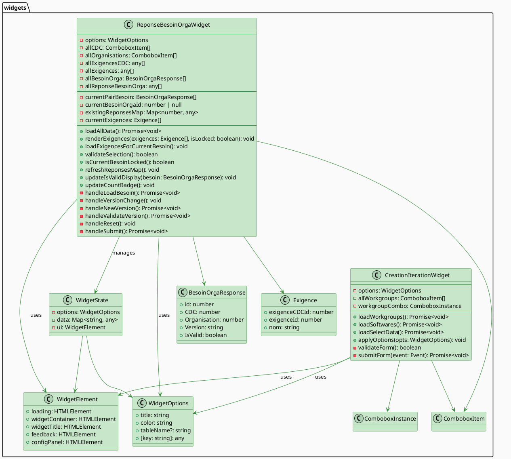
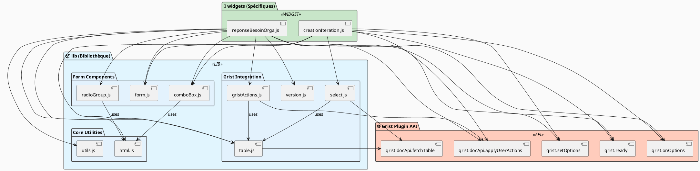

# WidgetGRIST
Bibliothèque de widget qui servent à rendre GRIST plus simple et visuel

## 🔧 Utilisation dans Grist

1. Dans une page Grist, ajouter une section **Widget personnalisé**
2. Coller l'URL du widget
3. Sélectionner la table source dans le panneau latéral
4. Choisir le niveau d'accès

## 🗂️ Structure du projet

```
WidgetGRIST/
├── README.md
├── lib/                          # Bibliothèque réutilisable
│   ├── html.js                  # Utilities DOM sécurisées
│   ├── utils.js                 # Utilitaires JavaScript génériques
│   ├── gristActions.js          # Wrappers haut niveau pour l'API Grist
│   ├── table.js                 # Extraction de données Grist
│   ├── form.js                  # Formulaires et validation
│   ├── select.js                # Composant <select> dynamique
│   ├── comboBox.js              # Combobox recherchable
│   ├── radioGroup.js            # Groupe de boutons radio
│   └── version.js               # Gestion des versions
├── widgets/                      # Widgets personnalisés
│   ├── creationIteration/       # Widget création d'itération
│   │   ├── creationIteration.html
│   │   ├── creationIteration.js
│   │   └── creationIteration.css
│   ├── reponseBesoinOrga/       # Widget réponse besoin organisation
│   │   ├── reponseBesoinOrga.html
│   │   ├── reponseBesoinOrga.js
│   │   └── reponseBesoinOrga.css
│   ├── creationCahierDesCharges/
│   ├── reponseCahierDesCharges/
│   └── reponseBilanSoft/
└── .github/
    └── workflows/
        └── deploy.yml
```

## 📊 Architecture du Projet

```plantuml
@startuml WidgetGRIST_Architecture
!define BGCOLOR_LIB #E1F5FE
!define BGCOLOR_WIDGET #C8E6C9
!define BGCOLOR_API #FFCCBC

skinparam backgroundColor #FAFAFA
skinparam componentStyle rectangle

package "Grist API" <<API>> #FFCCBC {
  interface "grist (Global)" as GRIST_API {
    +docApi: DocApi
    +ready(config)
    +onOptions(callback)
    +setOptions(options)
  }

  interface "DocApi" as DOC_API {
    +applyUserActions(actions)
    +fetchTable(tableName)
  }

  GRIST_API --> DOC_API
}

package "WidgetGRIST/lib - Bibliothèque Réutilisable" <<LIB>> #E1F5FE {
  component "html.js" as HTML_LIB {
    --
    +escapeHtml(value)
    +createElement(tag, attrs, content)
    +clearElement(element)
  }

  component "utils.js" as UTILS_LIB {
    --
    +indexBy(items, keyFn, valueFn)
    +groupBy(items, keyFn)
    +sleep(ms)
    +coalesce(value, fallback)
  }

  component "gristActions.js" as GRIST_LIB {
    --
    +applyActions(actions)
    +addRecord(tableName, fields)
    +updateRecord(tableName, id, fields)
    +upsertRecord(tableName, id, fields)
    +buildUpsertAction(tableName, id, fields)
  }

  component "table.js" as TABLE_LIB {
    --
    +fetchTableRows(tableName)
  }

  component "select.js" as SELECT_LIB {
    --
    +fetchDistinctValues(tableName, columnName)
    +populateSelect(element, tableName, columnName)
  }

  component "form.js" as FORM_LIB {
    --
    +showFeedback(element, msg, type)
    +setLoadingState(loadingEl, containerEl, state)
    +validateForm(rules)
    +clearValidation(rules)
    +toUnixTimestamp(dateStr, timeStr)
  }

  component "comboBox.js" as COMBO_LIB {
    --
    +initCombobox(config)
  }

  component "radioGroup.js" as RADIO_LIB {
    --
    +renderRadioGroupHTML(groupName, options)
    +getRadioValue(groupName)
    +validateRadioGroups(groups)
    +resetRadioGroup(groupName, groupId, errId)
  }

  component "version.js" as VERSION_LIB {
    --
    +nextVersion(besoinList)
    +populateVersionSelect(element, besoinList)
  }
}

package "WidgetGRIST/widgets - Composants Spécifiques" <<WIDGET>> #C8E6C9 {
  component "creationIteration.js" as WIDGET1 {
    --
    -options: WidgetOptions
    -allWorkgroups: ComboboxItem[]
    -workgroupCombo: ComboboxInstance
    --
    +loadWorkgroups()
    +loadSoftwares()
    +loadSelectData()
    +applyOptions(opts)
    +handleSubmit(event)
  }

  component "reponseBesoinOrga.js" as WIDGET2 {
    --
    -options: WidgetOptions
    -allCDC: ComboboxItem[]
    -allOrganisations: ComboboxItem[]
    -currentBesoinOrgaId: number
    -existingReponsesMap: Map
    -currentExigences: Exigence[]
    --
    +loadAllData()
    +renderExigences(exigences, isLocked)
    +loadExigencesForCurrentBesoin()
    +validateSelection()
    +isCurrentBesoinLocked()
    +handleLoadBesoin()
    +handleValidateVersion()
    +handleSubmit()
  }
}

' Dépendances horizontales
GRIST_API --> DOC_API

GRIST_LIB --> DOC_API
TABLE_LIB --> DOC_API
SELECT_LIB --> TABLE_LIB
SELECT_LIB --> DOC_API

' Dépendances du Widget 1
WIDGET1 --> TABLE_LIB
WIDGET1 --> SELECT_LIB
WIDGET1 --> COMBO_LIB
WIDGET1 --> FORM_LIB
WIDGET1 --> GRIST_API

' Dépendances du Widget 2
WIDGET2 --> TABLE_LIB
WIDGET2 --> COMBO_LIB
WIDGET2 --> FORM_LIB
WIDGET2 --> RADIO_LIB
WIDGET2 --> GRIST_LIB
WIDGET2 --> HTML_LIB
WIDGET2 --> UTILS_LIB
WIDGET2 --> VERSION_LIB
WIDGET2 --> GRIST_API

note right of HTML_LIB
  Sécurité DOM
  Pas de dépendances
end note

note right of UTILS_LIB
  Utilitaires purs
  Pas de dépendances
end note

note bottom of WIDGET1
  Création d'itération
  Tables: Iteration, WorkGroup, Software
end note

note bottom of WIDGET2
  Réponses aux besoins
  Tables: BesoinOrga, Exigence, CDC, etc.
end note

@enduml
```

## 📚 Diagramme de Classe - Bibliothèque (lib/)

```plantuml
@startuml WidgetGRIST_Library_Classes
!define BGCOLOR_CLASS #E3F2FD
!define BGCOLOR_INTERFACE #BBDEFB

skinparam backgroundColor #FAFAFA
skinparam classBackgroundColor #E3F2FD
skinparam classBorderColor #1976D2
skinparam arrowColor #1976D2

package "lib" {

  ' ===== CORE UTILITIES =====
  class Html {
    {static} +escapeHtml(value: any): string
    {static} +createElement(tag: string, attrs?: Record, content?: any): HTMLElement
    {static} +clearElement(el: HTMLElement): void
  }

  class Utils {
    {static} +indexBy(items: T[], keyFn: (T) => K, valueFn?: (T) => V): Map<K, V>
    {static} +groupBy(items: T[], keyFn: (T) => string): Record<string, T[]>
    {static} +sleep(ms: number): Promise<void>
    {static} +coalesce(value: T|null|undefined, fallback: T): T
  }

  ' ===== GRIST INTEGRATION =====
  class GristActions {
    {static} +applyActions(actions: any[]): Promise<any[]>
    {static} +addRecord(tableName: string, fields: Record): Promise<number>
    {static} +updateRecord(tableName: string, id: number, fields: Record): Promise<void>
    {static} +upsertRecord(tableName: string, id: number|null, fields: Record): Promise<number>
    {static} +buildUpsertAction(tableName: string, id: number|null, fields: Record): Array
  }

  class Table {
    {static} +fetchTableRows(tableName: string): Promise<Array<Record>>
  }

  class Select {
    {static} +fetchDistinctValues(tableName: string, columnName: string): Promise<string[]>
    {static} +populateSelect(selectEl: HTMLSelectElement, tableName: string, columnName: string, placeholder?: string): Promise<void>
  }

  class Version {
    {static} +nextVersion(besoinList: Array): string
    {static} +populateVersionSelect(selectEl: HTMLSelectElement, besoinList: Array, currentId: number): void
  }

  ' ===== FORM COMPONENTS =====
  class Form {
    {static} +showFeedback(feedbackEl: HTMLElement, msg: string, type: string, duration?: number): void
    {static} +setLoadingState(loadingEl: HTMLElement, containerEl: HTMLElement, state: string): void
    {static} +validateForm(rules: FieldRule[]): boolean
    {static} +clearValidation(rules: FieldRule[]): void
    {static} +toUnixTimestamp(dateStr: string, timeStr?: string): number|null
  }

  class ComboBox {
    {static} +initCombobox(config: ComboboxConfig): ComboboxInstance
  }

  class RadioGroup {
    {static} +renderRadioGroupHTML(groupName: string, options: RadioOption[], selected?: string, disabled?: boolean): string
    {static} +getRadioValue(groupName: string): string|null
    {static} +validateRadioGroups(groups: RadioGroupRule[]): boolean
    {static} +resetRadioGroup(groupName: string, groupId: string, errId: string, value?: string): void
  }

  ' ===== TYPE DEFINITIONS =====
  class ComboboxItem {
    +id: number
    +name: string
  }

  class ComboboxConfig {
    +searchInput: HTMLInputElement
    +hiddenInput: HTMLInputElement
    +dropdown: HTMLElement
    +errorEl?: HTMLElement
    +getItems: () => ComboboxItem[]
    +filterMode?: 'startsWith' | 'includes'
  }

  class ComboboxInstance {
    +reset(): void
    +select(item: ComboboxItem): void
    +getSelected(): ComboboxItem | null
  }

  class FieldRule {
    +fieldId: string
    +errId: string
    +visualId?: string
    +validator?: (value: string) => boolean
  }

  class RadioOption {
    +value: string
    +label: string
  }

  class RadioGroupRule {
    +groupName: string
    +groupId: string
    +errId: string
  }

  ' ===== RELATIONSHIPS =====
  ComboBox --> ComboboxConfig
  ComboBox --> ComboboxInstance
  ComboBox --> Html : uses
  ComboBox --> ComboboxItem

  RadioGroup --> RadioOption
  RadioGroup --> RadioGroupRule
  RadioGroup --> Html : uses

  Form --> FieldRule

  GristActions --> Table : uses
  Select --> Table : uses

  ComboboxConfig --> ComboboxItem
  ComboboxInstance --> ComboboxItem

}

@enduml
```



## 🎨 Diagramme de Classe - Widgets



## 🔗 Diagramme de Flux - Dépendances Complètes



## 📋 Conventions de Nommage

### **Fichiers et Dossiers**
| Type | Convention | Exemple |
|------|-----------|---------|
| Modules lib | `camelCase.js` | `comboBox.js`, `gristActions.js` |
| Widgets | `camelCase.js` | `creationIteration.js` |
| Dossiers widgets | `camelCase/` | `creationIteration/`, `reponseBesoinOrga/` |
| Styles | `camelCase.css` | `creationIteration.css` |

### **Code JavaScript**
| Type | Convention | Exemple |
|------|-----------|---------|
| Fonctions exportées | Verbe actif + `camelCase` | `initCombobox()`, `fetchTableRows()`, `showFeedback()` |
| Classes/Prototypes | `PascalCase` | `ComboboxConfig`, `FieldRule` |
| Variables collections | Pluriel + `camelCase` | `allWorkgroups`, `currentExigences`, `allCDC` |
| Identifiants | Suffixe `Id` | `exigenceId`, `cdcId`, `currentBesoinOrgaId` |
| Maps/Index | Suffixe `Map` ou `By` | `existingReponsesMap`, `exigenceMap` |
| Éléments DOM | Préfixe `el` + clé | `el.feedback`, `el.submitBtn`, `el.widgetContainer` |
| Booléens | Préfixe `is` ou suffixe `ed` | `isLocked`, `isValid`, `isLoading` |

### **Modèle DOM Elements**
```javascript
const el = {
  // État
  loading: document.getElementById('loading'),
  widgetContainer: document.getElementById('widget-container'),

  // Affichage
  widgetTitle: document.getElementById('widget-title'),
  feedback: document.getElementById('feedback'),

  // Formulaires
  form: document.getElementById('form'),
  submitBtn: document.getElementById('submit-btn'),

  // Configuration
  configPanel: document.getElementById('config-panel'),
};
```

## 🔄 Flux de Données - Exemple `reponseBesoinOrga`

```
┌─────────────────────────────────────────────────────────────┐
│ 1. INITIALISATION                                           │
├─────────────────────────────────────────────────────────────┤
│ grist.ready()                                               │
│   ↓                                                          │
│ grist.onOptions(opts)                                       │
│   ↓                                                          │
│ applyOptions(opts)                                          │
│   ↓                                                          │
│ loadAllData()                                               │
│   ├─ fetchTableRows('CahierDesCharges')                    │
│   ├─ fetchTableRows('Organisation')                        │
│   ├─ fetchTableRows('Exigence')                            │
│   ├─ fetchTableRows('ExigenceCDC')                         │
│   ├─ fetchTableRows('BesoinOrga')                          │
│   └─ fetchTableRows('ReponseBesoinOrga')                   │
└─────────────────────────────────────────────────────────────┘

┌─────────────────────────────────────────────────────────────┐
│ 2. CHARGEMENT BESOIN                                        │
├─────────────────────────────────────────────────────────────┤
│ el.loadBtn.click()                                          │
│   ↓                                                          │
│ validateSelection() [Form.validateForm]                     │
│   ↓                                                          │
│ (Si nouveau) addRecord(BesoinOrga) [GristActions]          │
│   ↓                                                          │
│ populateVersionSelect() [Version]                           │
│   ↓                                                          │
│ updateIsValidDisplay() + loadExigencesForCurrentBesoin()   │
└─────────────────────────────────────────────────────────────┘

┌─────────────────────────────────────────────────────────────┐
│ 3. AFFICHAGE EXIGENCES                                      │
├─────────────────────────────────────────────────────────────┤
│ loadExigencesForCurrentBesoin()                             │
│   ↓                                                          │
│ refreshReponsesMap() [Utils.indexBy]                        │
│   ↓                                                          │
│ renderExigences()                                           │
│   ├─ renderRadioGroupHTML() [RadioGroup]                   │
│   ├─ escapeHtml() [Html] - sécurité XSS                   │
│   └─ updateCountBadge()                                    │
└─────────────────────────────────────────────────────────────┘

┌─────────────────────────────────────────────────────────────┐
│ 4. VALIDATION ET SOUMISSION                                 │
├─────────────────────────────────────────────────────────────┤
│ el.submitBtn.click()                                        │
│   ↓                                                          │
│ validateRadioGroups() [RadioGroup]                          │
│   ↓                                                          │
│ Construire actions [GristActions.buildUpsertAction]        │
│   ├─ AddRecord si nouvelle réponse                         │
│   └─ UpdateRecord si existante                             │
│   ↓                                                          │
│ applyActions() [GristActions]                               │
│   ↓                                                          │
│ grist.docApi.applyUserActions() [Grist API]               │
│   ↓                                                          │
│ showFeedback() [Form]                                       │
│   ↓                                                          │
│ refreshReponsesMap() + renderExigences()                    │
└─────────────────────────────────────────────────────────────┘
```

