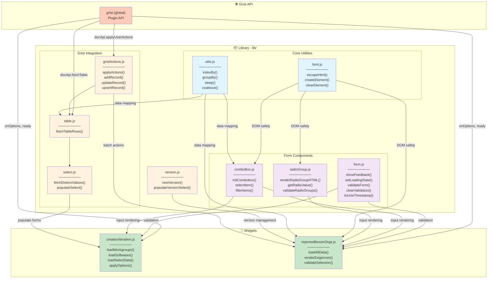

# WidgetGRIST
Bibliothèque de widget qui servent à rendre GRIST plus simple et visuel

## 🔧 Utilisation dans Grist

1. Dans une page Grist, ajouter une section **Widget personnalisé**
2. Coller l'URL du widget
3. Sélectionner la table source dans le panneau latéral
4. Choisir le niveau d'accès

## 🗂️ Structure du projet

```
WidgetGRIST/
├── README.md
├── lib/                          # Bibliothèque réutilisable
│   ├── html.js                  # Utilities DOM sécurisées
│   ├── utils.js                 # Utilitaires JavaScript génériques
│   ├── gristActions.js          # Wrappers haut niveau pour l'API Grist
│   ├── table.js                 # Extraction de données Grist
│   ├── form.js                  # Formulaires et validation
│   ├── select.js                # Composant <select> dynamique
│   ├── comboBox.js              # Combobox recherchable
│   ├── radioGroup.js            # Groupe de boutons radio
│   └── version.js               # Gestion des versions
├── widgets/                      # Widgets personnalisés
│   ├── creationIteration/       # Widget création d'itération
│   │   ├── creationIteration.html
│   │   ├── creationIteration.js
│   │   └── creationIteration.css
│   ├── reponseBesoinOrga/       # Widget réponse besoin organisation
│   │   ├── reponseBesoinOrga.html
│   │   ├── reponseBesoinOrga.js
│   │   └── reponseBesoinOrga.css
│   ├── creationCahierDesCharges/
│   ├── reponseCahierDesCharges/
│   └── reponseBilanSoft/
└── .github/
    └── workflows/
        └── deploy.yml
```

## 📊 Diagramme d'Architecture

### Dépendances et flux de données



### Modèle de classe détaillé

```mermaid
classDiagram
    direction TB
    
    namespace GristAPI {
        class GlobalGrist {
            +docApi: DocApi
            +setOptions(opts: Record)
            +ready(config: Config): void
            +onOptions(callback: Function): void
        }
        
        class DocApi {
            +applyUserActions(actions: Array): Promise~Record~
            +fetchTable(tableName: string): Promise~Record~
        }
    }
    
    namespace CoreUtilities {
        class Html {
            +escapeHtml(value: *): string
            +createElement(tag: string, attrs?: Record, content?: *): HTMLElement
            +clearElement(el: HTMLElement): void
        }
        
        class Utils {
            +indexBy(items: T[], keyFn: Function, valueFn?: Function): Map
            +groupBy(items: T[], keyFn: Function): Record
            +sleep(ms: number): Promise~void~
            +coalesce(value: T|null|undefined, fallback: T): T
        }
    }
    
    namespace GristIntegration {
        class GristActions {
            +applyActions(actions: Array): Promise~any[]~
            +addRecord(tableName: string, fields: Record): Promise~number~
            +updateRecord(tableName: string, id: number, fields: Record): Promise~void~
            +upsertRecord(tableName: string, existingId: number|null, fields: Record): Promise~number~
            +buildUpsertAction(tableName: string, existingId: number|null, fields: Record): Array
        }
        
        class Table {
            +fetchTableRows(tableName: string): Promise~Array~
        }
        
        class Select {
            +fetchDistinctValues(tableName: string, columnName: string): Promise~string[]~
            +populateSelect(selectEl: HTMLSelectElement, tableName: string, columnName: string, placeholder?: string): Promise~void~
        }
        
        class Version {
            +nextVersion(besoinList: Array): string
            +populateVersionSelect(selectEl: HTMLSelectElement, besoinList: Array, currentId: number): void
        }
    }
    
    namespace FormComponents {
        class Form {
            +showFeedback(el: HTMLElement, msg: string, type: string, duration?: number): void
            +setLoadingState(loadingEl: HTMLElement, containerEl: HTMLElement, state: string): void
            +validateForm(rules: FieldRule[]): boolean
            +clearValidation(rules: FieldRule[]): void
            +toUnixTimestamp(dateStr: string, timeStr?: string): number|null
        }
        
        class ComboBox {
            -activeIndex: number
            +initCombobox(config: ComboboxConfig): ComboboxInstance
            -filterItems(query: string): ComboboxItem[]
            -renderDropdown(filtered: ComboboxItem[]): void
            -selectItem(item: ComboboxItem): void
            -closeDropdown(): void
        }
        
        class RadioGroup {
            +renderRadioGroupHTML(groupName: string, options: RadioOption[], selected?: string, disabled?: boolean): string
            +getRadioValue(groupName: string): string|null
            +validateRadioGroups(groups: RadioGroupRule[]): boolean
            +resetRadioGroup(groupName: string, groupId: string, errId: string, value?: string): void
        }
    }
    
    namespace Widgets {
        class CreationIterationWidget {
            -options: WidgetOptions
            -allWorkgroups: ComboboxItem[]
            -workgroupCombo: ComboboxInstance
            +loadWorkgroups(): Promise~void~
            +loadSoftwares(): Promise~void~
            +loadSelectData(): Promise~void~
            +applyOptions(opts: Record): void
            -validateAndSubmit(): Promise~void~
        }
        
        class ReponseBesoinOrgaWidget {
            -options: WidgetOptions
            -allCDC: ComboboxItem[]
            -allOrganisations: ComboboxItem[]
            -currentBesoinOrgaId: number|null
            -existingReponsesMap: Map
            -currentExigences: Exigence[]
            +loadAllData(): Promise~void~
            +renderExigences(exigences: Exigence[], isLocked?: boolean): void
            +loadExigencesForCurrentBesoin(): void
            +validateSelection(): boolean
            +isCurrentBesoinLocked(): boolean
            +refreshReponsesMap(): void
            +updateIsValidDisplay(besoin: BesoinOrga): void
            -handleLoadBesoin(): Promise~void~
            -handleValidateVersion(): Promise~void~
            -handleSubmit(): Promise~void~
        }
    }
    
    namespace Types {
        class ComboboxItem {
            +id: number
            +name: string
        }
        
        class ComboboxConfig {
            +searchInput: HTMLInputElement
            +hiddenInput: HTMLInputElement
            +dropdown: HTMLElement
            +errorEl?: HTMLElement
            +getItems: Function
            +filterMode?: 'startsWith'|'includes'
        }
        
        class ComboboxInstance {
            +reset(): void
            +select(item: ComboboxItem): void
            +getSelected(): ComboboxItem|null
        }
        
        class FieldRule {
            +fieldId: string
            +errId: string
            +visualId?: string
            +validator?: Function
        }
        
        class RadioOption {
            +value: string
            +label: string
        }
        
        class RadioGroupRule {
            +groupName: string
            +groupId: string
            +errId: string
        }
        
        class WidgetOptions {
            +title: string
            +color: string
            +tableIteration?: string
            +tableWorkgroup?: string
            +tableSoftware?: string
        }
        
        class Exigence {
            +exigenceCDCId: number
            +exigenceId: number
            +nom: string
        }
        
        class BesoinOrga {
            +id: number
            +CDC: number
            +Organisation: number
            +Version: string
            +IsValid: boolean
        }
    }
    
    %% Relationships
    GlobalGrist --> DocApi
    
    CreationIterationWidget --> Html
    CreationIterationWidget --> Utils
    CreationIterationWidget --> GristActions
    CreationIterationWidget --> Table
    CreationIterationWidget --> Select
    CreationIterationWidget --> Form
    CreationIterationWidget --> ComboBox
    CreationIterationWidget --> GlobalGrist
    
    ReponseBesoinOrgaWidget --> Html
    ReponseBesoinOrgaWidget --> Utils
    ReponseBesoinOrgaWidget --> GristActions
    ReponseBesoinOrgaWidget --> Table
    ReponseBesoinOrgaWidget --> Form
    ReponseBesoinOrgaWidget --> ComboBox
    ReponseBesoinOrgaWidget --> RadioGroup
    ReponseBesoinOrgaWidget --> Version
    ReponseBesoinOrgaWidget --> GlobalGrist
    
    ComboBox --> ComboboxConfig
    ComboBox --> ComboboxInstance
    ComboBox --> ComboboxItem
    
    Form --> FieldRule
    RadioGroup --> RadioOption
    RadioGroup --> RadioGroupRule
    
    CreationIterationWidget --|> WidgetOptions
    ReponseBesoinOrgaWidget --|> WidgetOptions
    
    ReponseBesoinOrgaWidget --> Exigence
    ReponseBesoinOrgaWidget --> BesoinOrga
    
    Table --> GristActions
    GristActions --> GlobalGrist
    Select --> Table
```



## 🔗 Conventions de nommage

### Fichiers et dossiers
- **Minuscules avec `.js`, `.css`, `.html`** : `comboBox.js`, `creationIteration.js`
- **Dossiers widgets** : `camelCase` pour les noms composés (`creationIteration`, `reponseBesoinOrga`)

### Classes et objets
- **Pseudo-classes (objets config)** : `ComboboxConfig`, `FieldRule`, `RadioGroupRule`
- **Instances** : `workgroupCombo`, `allWorkgroups`, `currentExigences`

### Fonctions
- **Exports** : `camelCase`, explicites et verbes actifs
  - `initCombobox()`, `fetchTableRows()`, `showFeedback()`
  - `validateForm()`, `renderRadioGroupHTML()`
- **Privées/Internes** : préfixe `_` ou commentaire `// ──`

### Variables
- **Collections plurielles** : `allWorkgroups`, `allCDC`, `allExigences`
- **Identifiants** : suffixe `Id` pour les nombres
  - `exigenceId`, `currentBesoinOrgaId`, `cdcId`
- **Maps/Index** : suffixe `Map` ou `ByX`
  - `existingReponsesMap`, `exigenceMap`

### DOM Elements
- **Préfixe `el`** : regroupement en objet singleton
  ```javascript
  const el = {
    widgetContainer: document.getElementById('widget-container'),
    feedback: document.getElementById('feedback'),
    submitBtn: document.getElementById('submit-btn'),
  };
  ```

## 📘 Flux de données type

### Widget `reponseBesoinOrga` (exemple complet)

```
1. [Initialisation]
   grist.ready() → grist.onOptions()
   └─ applyOptions(opts)
   └─ loadAllData()
      ├─ fetchTableRows('CahierDesCharges')
      ├─ fetchTableRows('Organisation')
      ├─ fetchTableRows('Exigence')
      ├─ fetchTableRows('ExigenceCDC')
      ├─ fetchTableRows('BesoinOrga')
      └─ fetchTableRows('ReponseBesoinOrga')

2. [Sélection CDC + Organisation]
   User input → el.loadBtn.click()
   ├─ validateSelection() ← Form.validateForm()
   ├─ addRecord() ← gristActions.js ← GristAPI
   └─ currentPairBesoin = [BesoinOrga]
   └─ populateVersionSelect()

3. [Affichage des exigences]
   loadExigencesForCurrentBesoin()
   ├─ indexBy(allExigences) ← Utils.indexBy()
   ├─ renderExigences() → renderRadioGroupHTML()
   └─ updateCountBadge()

4. [Validation et soumission]
   el.submitBtn.click()
   ├─ validateRadioGroups() ← RadioGroup.validateRadioGroups()
   ├─ buildUpsertAction() ← GristActions
   ├─ applyActions() → GristAPI.applyUserActions()
   └─ showFeedback() ← Form.showFeedback()
```

